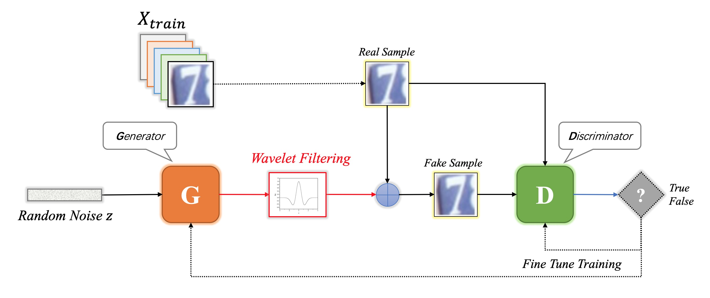
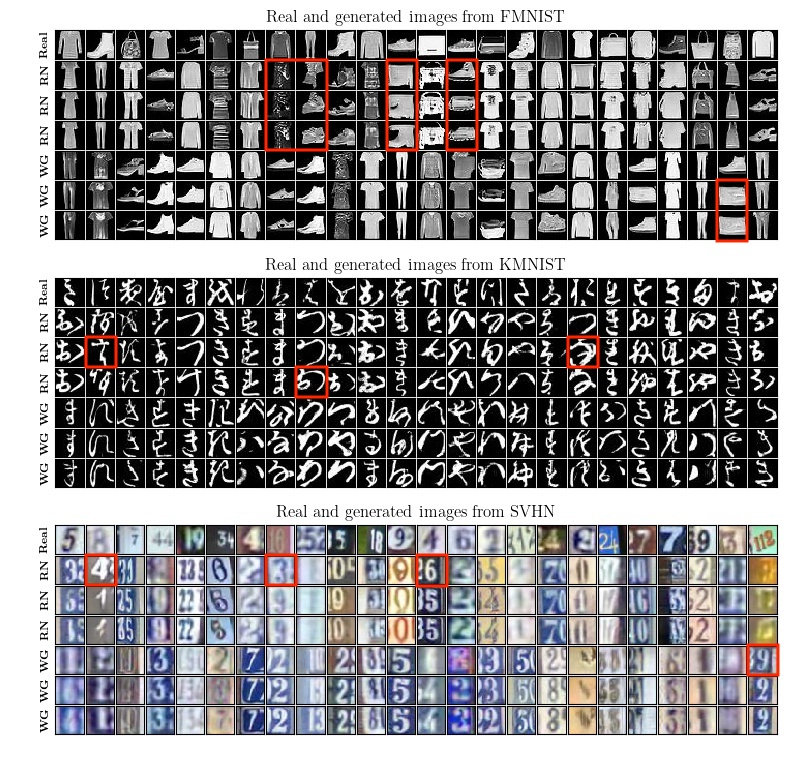
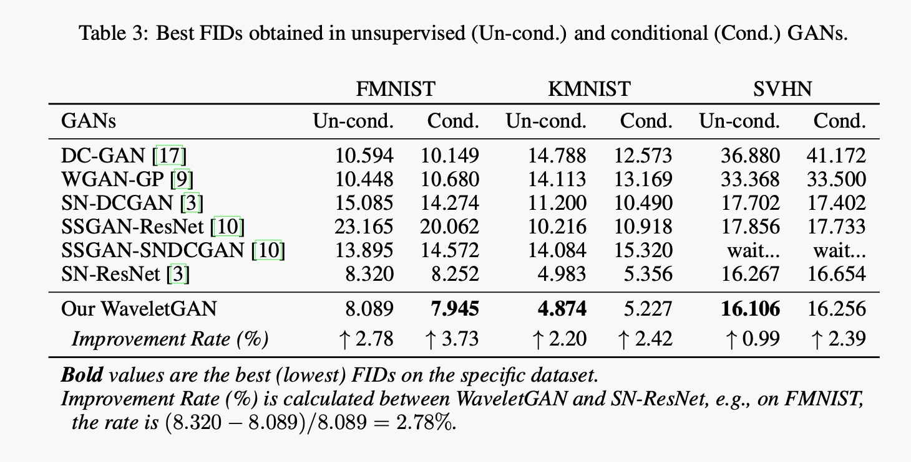

NOTE: This repository is fored from google/compare_gan, and contains the implementations and experiments for our paper (below) as well. Some new tips and workarounds are added to reproduce the training from scratch, mainly in mainland of China. More information about the original [google/compare_gan](https://github.com/google/compare_gan) can be found in [README-Google.md](./README-Google.md). 

# Noise Homogenization via Multi-Channel Wavelet Filtering for High-Fidelity Sample Generation in GANs

In the generator of typical Generative Adversarial Networks (GANs), a noise is inputted to generate fake samples via a series of convolutional operations. However, current noise generation models merely relies on the information from the pixel space, which increases the difficult to approach the target distribution. In this work, we propose a novel multi-channel wavelet-based filtering for GANs, to cope with this problem. When embedding a wavelet deconvolution layer in the generator, the resultant GAN, called WaveletGAN, takes advantage of wavelet deconvolution to learn a filtering with multiple channels, which can efficiently homogenize the generated noise via an averaging operation, so as to generate high-fidelity samples. 



Figure 1. WaveletGAN architecture using wavelet filtering to homogenize the generated noise.

## Enable WaveletDeconv in GANs in one line of code

```python
    # Final processing of the output.
    output = self.batch_norm(
        output, z=z, y=y, is_training=is_training, name="final_norm")
    output = tf.nn.relu(output)
    output = ops.conv2d(output, output_dim=self._image_shape[2], k_h=3, k_w=3,
                        d_h=1, d_w=1, name="final_conv",
                        use_sn=self._spectral_norm,)
    
    if self._wavelet_deconv: # Add WaveletDeconv layer
        output = ops.waveletDeconv(output)
```  

The code can be found in [resnet_mnist.py](./compare_gan/architectures/resnet_mnist.py).

## Requirements

To install requirements:

```bash
pip install -e .
```

## Model configurations (.gin)

The .gin config files related with our models are all in [example_configs](./example_configs/):

1. resnet_fmnist_WaveletGAN.gin - our WaveletGAN using ResNet on Fashion-MNIST.
2. resnet_kmnist_WaveletGAN.gin - our WaveletGAN using ResNet on KMNIST.
3. resnet_svhn_WaveletGAN.gin - our WaveletGAN using ResNet on SVHN.

The option to enable WaveletDeconv in the generator is 

```bash   
# Enable WaveletDeconv (True or False)
G.wavelet_deconv= True
```   

The same directory contains more config files provided by Google. 

## Train and Evaluation

```  
To see all available options please run `python main.py --help`. Main options:

*   To **train** the model use `--schedule=train` (default). Training is resumed
    from the last saved checkpoint.
*   To **evaluate** all checkpoints use `--schedule=continuous_eval
    --eval_every_steps=0`. To evaluate only checkpoints where the step size is
    divisible by 5000, use `--schedule=continuous_eval --eval_every_steps=5000`.
    By default, 3 averaging runs are used to estimate the Inception Score and
    the FID score. Keep in mind that when running locally on a single GPU it may
    not be possible to run training and evaluation simultaneously due to memory
    constraints.
*   To **train and evaluate** the model use `--schedule=eval_after_train
    --eval_every_steps=0`.
```  

To train and evaluate our models, run the following commands in compare_gan/compare_gan:

1. Fashion-MNIST:

```bash   
python main.py --gin_config ../example_configs/resnet_fmnist_WaveletGAN.gin --model_dir ../resnet_fmnist_WaveletGAN --score_filename resnet_fmnist_WaveletGAN_score.csv --schedule eval_after_train 
```  

2. KMNIST:

```bash   
python main.py --gin_config ../example_configs/resnet_kmnist_WaveletGAN.gin --model_dir ../resnet_kmnist_WaveletGAN --score_filename resnet_kmnist_WaveletGAN_score.csv --schedule eval_after_train 
```  

3. SVHN:

```bash   
python main.py --gin_config ../example_configs/resnet_svhn_WaveletGAN.gin --model_dir ../resnet_svhn_WaveletGAN --score_filename resnet_svhn_WaveletGAN_score.csv --schedule eval_after_train 
```  

## Pre-trained Models

1. Baidu Netdisk: https://pan.baidu.com/s/1uQu-2i_NLxAgZvrbi6dgqw (8k8f)
2. Google Dirve: https://drive.google.com/open?id=187WCyYEvT_9VDkk36nWLc-HxHr2btXqC

## Results

1. The generated samples



Figure 2. The real and generated samples from each dataset.

2. FIDs



## Contributing

Please refer to https://github.com/google/compare_gan. 


# Tips and Workarounds

The goals are to:

- Make it work in mainland, China. 
- Fix some issues locally. 
- Discuss with ones who in the same environment. 
- Contribute to cutting-edge GAN research. 

### Tip.1 Pick the right versions

After installing the prerequired libraries via 
```  
pip install -e .
```  

Make sure you are using the following versions of tools:  
```   
sudo apt install cuda-10-0  
pip install tensorflow-gpu==1.13.1  
```   

Install a newer version of tensorflow-datasets:
```   
pip install tensorflow-datasets==1.0.2
```   

## Tip.2 Some known issues

- See the [commit](https://github.com/zengsn/compare_gan/commit/fb34717b4863312c681f8174dfbb1984d9dddeed) to fix 
```  
TypeError: '<=' not supported between instances of 'int' and 'str'
```  

